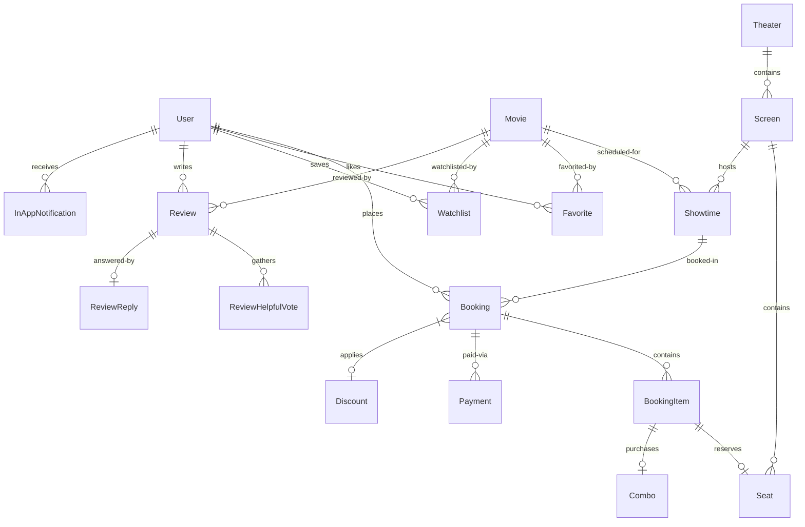

# CineVerse System Architecture

This document describes the architectural layout, package structure, and separation of concerns implemented in **CineVerse**.

---

## 🏗️ Architectural Layers

CineVerse is built using a decoupled layered architecture on top of the Django framework, separating concerns from databases to front-end presentation.

```
      +-------------------------------------------+
      |        Presentation (MVT / Templates)      |
      |   (HTML / CSS / JS / Components / Pages)  |
      +---------------------+---------------------+
                            |
                            v
      +---------------------+---------------------+
      |              Views / Controllers          |
      |          (views.py, views_admin.py)       |
      +---------------------+---------------------+
                            |
                            v
      +---------------------+---------------------+
      |            Service Layer (Logic)          |
      |                (services.py)              |
      +---------------------+---------------------+
                            |
                            v
      +---------------------+---------------------+
      |           Design Patterns Engine          |
      |                (patterns.py)              |
      +---------------------+---------------------+
                            |
                            v
      +---------------------+---------------------+
      |            Repository Layer (Data)        |
      |              (repositories.py)            |
      +---------------------+---------------------+
                            |
                            v
      +---------------------+---------------------+
      |                Models (ORM)               |
      |                 (models.py)               |
      +-------------------------------------------+
```

### 1. Presentation Layer (MVT)
Managed by Django templates located in `cinema/templates/cinema/`. Reorganized for clarity:
- **`auth/`**: Registration, login, forgot password, reset password.
- **`pages/`**: Main functional pages like movie browsing, booking, ticket rendering, and profiles.
- **`pages/admin/`**: Admin dashboards and lists.
- **`components/`**: Extracted global components (`navbar.html`, `footer.html`, `sidebar_admin.html`).

### 2. View / Controller Layer
Handles requests, session state, and redirects.
- **`views.py`**: Handles user flow endpoints.
- **`views_admin.py`**: Handles management flow endpoints, secured via role-based authentication.

### 3. Business Service Layer
Orchestrates business logic and transactions in `services.py`. It calls the Patterns engine to execute core booking flows and delegates queries to the Repository layer.

### 4. Design Patterns Layer
Houses structural, creational, and behavioral design patterns in `patterns.py` to enforce clean, maintainable software design.

### 5. Repository Layer
Abstracts direct database queries using Django ORM in `repositories.py`.

---

## 📂 Project Directory Layout

```text
d:/Cinema Management System/
│
├── cinema/                        # Application Source Code
│   ├── migrations/                # Database Migration Scripts
│   ├── static/                    # Frontend Assets (CSS/JS/Images)
│   ├── templates/cinema/          # Django Templates
│   │   ├── auth/                  # Login & Signup Views
│   │   ├── components/            # Extracted UI Snippets
│   │   └── pages/                 # User & Admin Views
│   │
│   ├── utils/
│   │   └── decorators.py          # Role-based Authorization Decorators
│   │
│   ├── exceptions.py              # Specialized Domain Exceptions
│   ├── models.py                  # Django DB Models
│   ├── patterns.py                # 15 Design Pattern Implementations
│   ├── repositories.py            # Data Access Layer
│   ├── services.py                # Business Logic Layer
│   ├── urls.py                    # App Routing Links
│   ├── views.py                   # User Views & Endpoints
│   └── views_admin.py             # Admin Views & Endpoints
│
├── cinema_project/                # Project Settings and Configuration
├── seed.py                        # Database Seeding Utility
├── requirements.txt               # Application Dependencies
└── README.md                      # General Information
```

---

## 📊 Database Schema ERD

Below is the entity-relationship diagram (ERD) of CineVerse, showing how the database models (including the new `Combo` model and extended `BookingItem`) relate:



