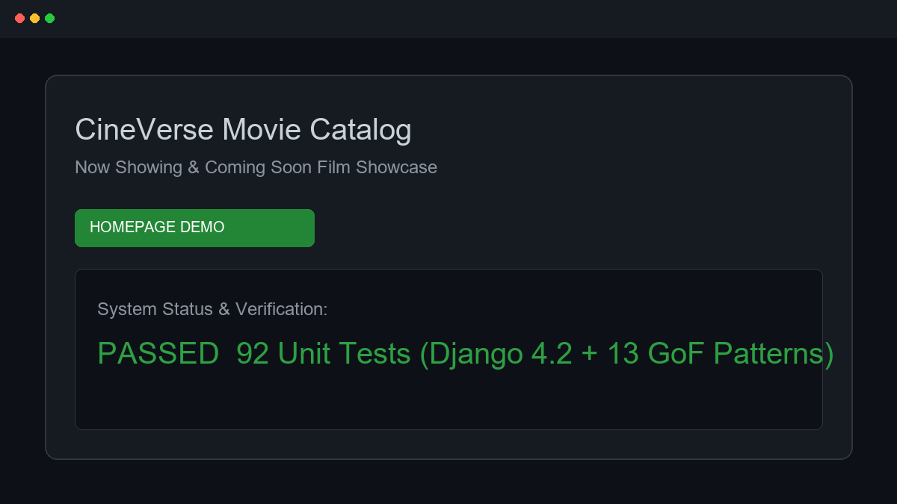
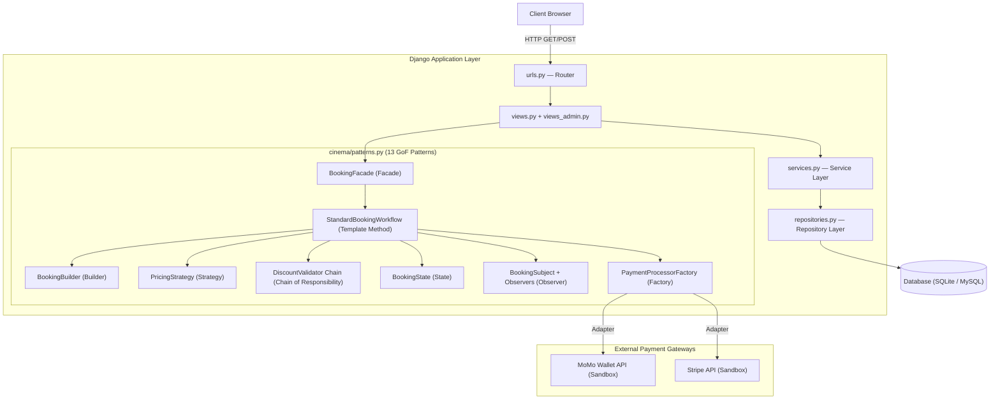

# **CineVerse — Cinema Management System**

> A full-featured cinema ticketing and management platform built with Django, implementing 13 GoF design patterns across a layered service architecture.

---

[](https://www.python.org/)
[](https://www.djangoproject.com/)
[](https://www.sqlite.org/)
[](https://www.mysql.com/)
[](./cinema/tests.py)
[](./cinema/tests.py)
[](./cinema/patterns.py)
[](./LICENSE)

---

<!-- SCREENSHOT SECTION -->
<!-- ══════════════════════════════════════════════════════════════════
     ACTION REQUIRED — Add screenshots to: docs/screenshots/
     Recommended screenshots to capture:
       1. demo.png       — Homepage showing Now Showing / Coming Soon movie grid
       2. booking.png    — Seat selection screen during the booking flow
       3. payment.png    — MoMo mock payment gateway or booking confirmation page
       4. dashboard.png  — Admin dashboard with revenue chart and top movies
       5. profile.png    — User profile page showing loyalty tier + booking history
     ══════════════════════════════════════════════════════════════════ -->


> *Screenshot: CineVerse Movie Catalog homepage showcase.*

---

## ✨ Features

### Customer-Facing
- **Movie Catalog** — Browse Now Showing and Coming Soon films; filter by genre, format (2D / 3D / IMAX), and keyword search.
- **Movie Detail & Showtimes** — Displays synopsis, trailer embed, cast/director, age ratings, and upcoming showtime schedules.
- **Interactive Seat Map** — Real-time seat selection supporting Normal, VIP (+50% price), and Couple (2x price) seat types.
- **Dynamic Pricing Engine** — Automatic ticket pricing adjustments for Weekday (−10%), Weekend (+20%), Holiday (+30%), and Happy Hour (−20%) showtimes.
- **Loyalty Points & Tiers** — Earn 1 point per 10,000 VND spent; automatically progress through Bronze → Silver (100 pts) → Gold (300 pts) → Platinum (1,000 pts) tiers; redeem points for up to 50% discount.
- **Voucher Validation Pipeline** — Multi-rule discount validation chain (expiry date, minimum spend, usage caps, per-user limits, tier eligibility, movie restrictions).
- **Food & Beverage Combos** — Add combo add-ons during checkout.
- **Payment Gateway Integration** — MoMo e-wallet sandbox (HMAC-SHA256 signatures with local mock fallback) and Stripe API integration.
- **Self-Service Ticket Cancellation** — Configurable cancellation fee; automatically reverses awarded loyalty points and updates membership tier.
- **Reviews & Ratings** — User star ratings and text comments with "helpful" voting and admin responses.
- **Favorites & Watchlist** — Save movies to personal favorites or a watchlist with optional reminder flags.
- **In-App Notifications** — Persistent notification feed updated on booking confirmation and cancellation.
- **User Profile & History** — View active tickets, past booking history, and current loyalty tier status.

### Admin Dashboard
- **Analytics Overview** — Total revenue, total bookings, active users, occupancy rates, 6-month monthly revenue charts, and top 5 movies.
- **Movie Management** — Full CRUD operations for movies (add, edit, update status).
- **Showtime Management** — Schedule showtimes per screen, bulk CSV upload, and clone existing showtimes across dates.
- **User & Staff Control** — User account ban/unban management and staff ticket verification by booking ID.

---

## 🎨 Design Patterns Implemented

This project serves as the capstone implementation for the **Software Design Patterns** course. **13 GoF patterns** are implemented in [`cinema/patterns.py`](file:///d:/Cinema%20Management%20System/cinema/patterns.py), alongside 2 architectural patterns.

| # | Pattern | Category | Implementation Location & Description |
|---|---|---|---|
| 1 | **Singleton** | Creational | `SystemSettings` — Ensures a single global configuration registry for cancellation fees, seat-lock timeouts, tax rates, and point conversion rules. |
| 2 | **Builder** | Creational | `BookingBuilder` — Construct complex `Booking` instances step-by-step (user → showtime → seats → combos → discount → totals) avoiding telescoping constructors. |
| 3 | **Simple Factory** | Creational | `PaymentProcessorFactory.create_processor()` — Instantiates the appropriate payment gateway adapter (`StripeAdapter` or `MomoAdapter`) based on a lookup string. |
| 4 | **Prototype** | Creational | `MoviePrototype.clone()` / `ShowtimePrototype.clone()` — Enables admins to duplicate existing movie entries or replicate showtime schedules across multiple dates. |
| 5 | **Adapter** | Structural | `StripeAdapter` & `MomoAdapter` — Wrap third-party APIs (Stripe cents vs. MoMo redirect URLs + HMAC signatures) behind a unified `PaymentGateway` interface. |
| 6 | **Decorator** | Structural | `VIPSeatPriceDecorator` (+50%) & `CoupleSeatPriceDecorator` (×2) — Dynamically wrap seat price calculations at runtime without subclassing model trees. |
| 7 | **Facade** | Structural | `BookingFacade.book_ticket()` — Provides a single unified entry point hiding seat decoration, pricing strategy resolution, discount chains, payment, state transitions, and observer notifications. |
| 8 | **Strategy** | Behavioral | `PricingStrategy` hierarchy (`WeekdayPricing`, `WeekendPricing`, `HolidayPricing`, `HappyHourPricing`) — Dynamically selected by `get_pricing_strategy(showtime_datetime)`. |
| 9 | **Observer** | Behavioral | `BookingSubject` notifies registered `EmailObserver` (simulated log) and `InAppObserver` (database notification feed) on booking status changes. |
| 10 | **Chain of Responsibility** | Behavioral | `DiscountValidator` chain — 8 chained validator nodes (Expiry → MinAmount → UsageLimit → PerUserLimit → Tier → MovieSpecific → PointsCombo → GoldenHour). |
| 11 | **State** | Behavioral | `BookingState` hierarchy (`PendingState`, `ConfirmedState`, `CompletedState`, `CancelledState`) — Manages lifecycle transitions and side-effects (points award/reversal, tier recalculation). |
| 12 | **Template Method** | Behavioral | `BookingWorkflow.execute()` — Defines the invariant booking transaction pipeline (validate user → validate seats → resolve discount → build → pay → state change → notify). |
| 13 | **Command** | Behavioral | `BookCommand` & `CancelCommand` — Encapsulate booking and cancellation actions as command objects for decoupled execution and transactional logging. |
| 14 | **Repository** *(Architectural)* | — | `UserRepository`, `MovieRepository`, `BookingRepository`, `ShowtimeRepository`, `DiscountRepository` in [`cinema/repositories.py`](file:///d:/Cinema%20Management%20System/cinema/repositories.py) — Abstract database access from business logic. |
| 15 | **MVT** *(Architectural)* | — | Standard Django Model-View-Template separation separating models, service controllers, and HTML render templates. |

---

## 🛠️ Tech Stack

| Layer | Technology |
|---|---|
| **Backend Framework** | Django 4.2 (Python 3.10+) |
| **Database** | SQLite 3 (default development) / MySQL (production-compatible via PyMySQL) |
| **Security & Auth** | Django Authentication, bcrypt password hashing, `@role_required` decorator |
| **Payment Gateways** | MoMo E-Wallet Sandbox API (HMAC-SHA256 signed) · Stripe API (sandbox) |
| **Configuration** | `python-decouple` (`.env` support) |
| **Frontend** | Vanilla HTML5 / CSS3 / JavaScript (no SPA framework requirement) |

---

## 🏗️ System Architecture



---

## 🚀 Getting Started

### Prerequisites
- [Python 3.10+](https://www.python.org/downloads/)
- `pip` package manager
- Git

### 1. Clone the Repository

```bash
git clone https://github.com/phidanghai-spec/Cinema-Management-System.git
cd Cinema-Management-System
```

### 2. Create and Activate Virtual Environment

```bash
# Windows (PowerShell)
python -m venv .venv
.\.venv\Scripts\Activate.ps1

# macOS / Linux
python -m venv .venv
source .venv/bin/activate
```

### 3. Install Dependencies

```bash
pip install -r requirements.txt
```

### 4. Configure Environment Variables

```bash
cp .env.example .env
```

### 5. Apply Database Migrations

```bash
# Using SQLite backend
$env:DB_ENGINE='django.db.backends.sqlite3'
python manage.py migrate
```

### 6. Seed Demo Data

```bash
python seed.py
```

### 7. Run Development Server

```bash
python manage.py runserver
```

Open [http://127.0.0.1:8000](http://127.0.0.1:8000) in your browser.

**Default Seeded Credentials:**

| Role | Email | Password |
|---|---|---|
| Admin | `admin@cinema.com` | `admin123` |
| Customer | `customer@cinema.com` | `customer123` |

**Demo Promo Code:** `SUMMER2026` (20% discount)

---

## 📋 Environment Variables

Table of required environment variables defined in `.env.example`:

| Variable | Description | Default / Example Placeholder |
|---|---|---|
| `SECRET_KEY` | Django application secret key | `django-insecure-...` |
| `DEBUG` | Enable Django debug mode | `True` |
| `ALLOWED_HOSTS` | Allowed hostnames for the server | `127.0.0.1,localhost` |
| `DB_ENGINE` | Database backend engine | `django.db.backends.sqlite3` |
| `DB_NAME` | Database name or SQLite file path | `db.sqlite3` |
| `DB_USER` | MySQL database username | `root` |
| `DB_PASSWORD` | MySQL database password | `[YOUR_DB_PASSWORD]` |
| `DB_HOST` | MySQL database host | `127.0.0.1` |
| `DB_PORT` | MySQL database port | `3306` |
| `MOMO_PARTNER_CODE` | MoMo Sandbox partner code | `MOMOBKUN20180810` |
| `MOMO_ACCESS_KEY` | MoMo Sandbox access key | `[YOUR_MOMO_ACCESS_KEY]` |
| `MOMO_SECRET_KEY` | MoMo Sandbox secret key | `[YOUR_MOMO_SECRET_KEY]` |

---

## 🧪 Testing & Quantitative Metrics

The automated test suite in [`cinema/tests.py`](file:///d:/Cinema%20Management%20System/cinema/tests.py) covers all 13 design patterns, services, repositories, and API endpoints.

### Empirical Code Coverage Report

| Module | Statements | Missed | Coverage |
|---|---|---|---|
| `cinema/models.py` | 230 | 25 | **89%** |
| `cinema/patterns.py` *(Design Patterns Core)* | 603 | 112 | **81%** |
| `cinema/repositories.py` *(Data Access Layer)* | 93 | 9 | **90%** |
| `cinema/services.py` *(Business Logic)* | 140 | 26 | **81%** |
| `cinema/tests.py` | 592 | 2 | **99%** |
| `cinema/views.py` *(Customer Endpoints)* | 557 | 175 | **69%** |
| **TOTAL SYSTEM COVERAGE** | **2,500** | **510** | **80%** |

### Execution Performance Benchmarks

Measured using Python `time.perf_counter` across 50,000 iterations:

| Core Pattern / Operation | Microsecond / Call | Nanoseconds / Call |
|---|---|---|
| `PricingStrategy` resolution & execution | **2.35 µs** | ~2,350 ns |
| `SeatPriceDecorator` dynamic calculation | **3.31 µs** | ~3,310 ns |

To execute the test suite & coverage report locally:

```bash
# Run all tests using SQLite engine
$env:DB_ENGINE='django.db.backends.sqlite3'
python manage.py test cinema -v 2

# Run code coverage report
coverage run manage.py test cinema
coverage report --include="cinema/*"
```

---

## 📂 Folder Structure

```
Cinema-Management-System/
├── docs/
│   └── screenshots/                 # Demo screenshots
├── cinema/                          # Main Django Application
│   ├── models.py                    # Data Models (User, Movie, Seat, Showtime, Booking...)
│   ├── patterns.py                  # 13 GoF Design Patterns Implementation
│   ├── services.py                  # Business Logic Layer
│   ├── repositories.py              # Repository / Data Access Object Layer
│   ├── views.py                     # Customer Views & API Handlers
│   ├── views_admin.py               # Admin Dashboard Views
│   ├── urls.py                      # Application URL Routing
│   ├── exceptions.py                # Custom Exception Classes
│   ├── tests.py                     # 92 Unit Test Methods
│   ├── templates/
│   │   └── cinema/
│   │       ├── base.html            # Layout Base Template
│   │       ├── base_admin.html      # Admin Layout Base
│   │       └── pages/               # Movie catalog, seat map, checkout templates
│   └── static/                      # CSS, JavaScript & Assets
├── cinema_project/                  # Django Project Settings & Root Router
├── manage.py                        # Django Management CLI
├── seed.py                          # Demo Data Seeder Script
├── requirements.txt                 # Python Dependencies
├── .env.example                     # Environment Configuration Template
├── PATTERNS.md                      # Detailed Pattern Mapping Rationale
├── ARCHITECTURE.md                  # Comprehensive Architectural Specification
└── README.md                        # Primary Project Repository README
```

---

## 👤 Author

**Đặng Hải Phi** — `phidanghai-spec`  
**Role**: Full-Stack Developer & Software Architect  
**Project**: Capstone Project for *Mẫu Thiết Kế Phần Mềm* (Software Design Patterns)  
**GitHub Profile**: [phidanghai-spec](https://github.com/phidanghai-spec)

---

## 📄 License

This project is licensed under the [MIT License](./LICENSE).

---

<p align="center">CineVerse © 2026 — Demonstrating 13 GoF Design Patterns in Python & Django</p>
