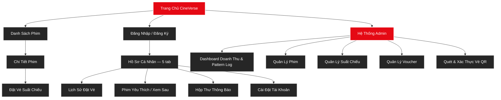
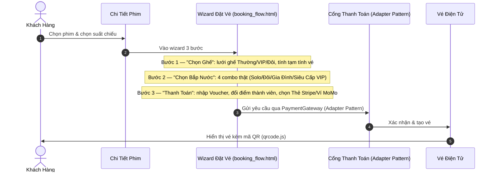

# 🎬 CINEVERSE — TÀI LIỆU KIẾN TRÚC GIAO DIỆN (UI/UX ARCHITECTURE DOCUMENTATION)

> **Lưu ý về bản chất tài liệu:** Đây là tài liệu **tổng kết kiến trúc giao diện đã triển khai**, được biên soạn sau khi hệ thống hoàn thiện, nhằm mục đích hệ thống hóa Sitemap, User Flow, cấu trúc màn hình và bộ linh kiện (Component Library) đang tồn tại trong mã nguồn — phục vụ trình bày, bảo vệ đồ án và làm tư liệu portfolio. Tài liệu **không phải** bản thiết kế Figma gốc được lập trước khi viết code.

---

## 🎨 1. HỆ THỐNG NHẬN DIỆN THƯƠNG HIỆU (ĐÃ TRIỂN KHAI)

CineVerse là nền tảng quản lý và đặt vé rạp chiếu phim theo phong cách **Glassmorphism Dark UI**, lấy cảm hứng từ trải nghiệm đặt hàng nhanh gọn của các nền tảng streaming/thương mại hiện đại, kết hợp nghiệp vụ thực tế của các chuỗi rạp chiếu phim.

### Bảng màu chủ đạo — trích trực tiếp từ `cinema/static/cinema/css/variables.css`

| Token CSS | Giá trị Hex | Vai trò |
|---|---|---|
| `--color-bg-primary` | `#0f0f0f` | Nền chính — đen sâu, mô phỏng không gian phòng chiếu tối |
| `--color-bg-secondary` | `#1a1a1a` | Nền khối phụ |
| `--color-bg-tertiary` | `#262626` | Nền card/panel — tạo độ tương phản chiều sâu |
| `--color-bg-glass` | `rgba(26,26,26,0.65)` | Hiệu ứng kính mờ (glassmorphism), kết hợp `backdrop-filter: blur(18px)` |
| `--color-primary` | `#e50914` | Đỏ điện ảnh — nút hành động chính, nhấn mạnh |
| `--color-primary-light` | `#ff4b3d` | Trạng thái hover/glow của màu chính |
| `--color-secondary` | `#3b82f6` | Xanh dương — thông tin phụ |
| `--color-success` | `#10b981` | Xanh lá — thanh toán thành công, ghế đang chọn |
| `--color-error` | `#ef4444` | Đỏ tươi — cảnh báo, hủy vé, ghế đã đặt |
| `--color-warning` | `#f59e0b` | Vàng cam — đánh giá sao, ưu đãi |

*(Bảng trên phản ánh đúng token thực tế trong code, không phải màu đề xuất mang tính minh họa.)*

### Typography — trích từ `typography.css`

* **Font duy nhất toàn hệ thống:** `Inter` (nhập qua Google Fonts CDN), dùng cho cả heading (`--font-family-heading`) lẫn nội dung (`--font-family-main`). Hệ thống hiện **không** dùng font thứ hai riêng cho tiêu đề.
* Thang cỡ chữ theo hệ số chuẩn: `12px → 48px` (`--text-xs` đến `--text-5xl`), 6 mức độ đậm nhạt từ `300` đến `800`.

---

## 🗺️ 2. SITEMAP HỆ THỐNG



*So với bản nháp ban đầu, sơ đồ này bỏ các nhánh chưa có route thật trong `cinema/urls.py` (Cinemas/CinemaDetail, Promotions, News, Contact) để tránh mô tả sai tính năng không tồn tại. Nếu các trang đó đã được code thêm sau thời điểm này, cần bổ sung lại và đối chiếu `urls.py`.*

---

## 🔄 3. USER FLOW — LUỒNG ĐẶT VÉ (ĐÃ VIỆT HÓA HOÀN TOÀN)



**Đối chiếu logic nghiệp vụ đã kiểm chứng thật (không chỉ đọc code):** mã giảm giá/điểm thành viên chỉ áp dụng lên phần tạm tính vé, **không** trừ vào giá trị combo — đã verify bằng kịch bản đặt vé thật (2 ghế + Combo Đôi x2 + mã `SUMMER2026` 20%) cho kết quả đúng khớp tính tay.

---

## 🎨 4. CẤU TRÚC MÀN HÌNH CHÍNH (WIREFRAME MÔ TẢ)

### Wizard Đặt Vé — 3 bước (khớp `booking_flow.html` sau localize)

```
┌────────────────────────────────────────────────────────────────────────┐
│  [ (1) Chọn Ghế ] ------> (2) Chọn Bắp Nước ------> (3) Thanh Toán      │
├────────────────────────────────────────────────────────────────────────┤
│ 🎭 CHỌN GHẾ CỦA BẠN                              │ 🧾 TÓM TẮT ĐƠN HÀNG  │
│   Chú thích: Thường(80k) VIP(120k) Đôi(200k)     │  Ghế đã chọn: [..]  │
│   Trạng thái: Đang Chọn / Đã Đặt                 │  Tạm tính vé: ... VNĐ│
│   [ Tiếp Tục Chọn Combo → ]                       │                      │
├────────────────────────────────────────────────────────────────────────┤
│ 🍿 CHỌN BẮP NƯỚC & ĐỒ ĂN NHẸ                     │  Tạm tính combo:     │
│   Combo Solo — 75.000 VNĐ                        │  ... VNĐ             │
│   Combo Đôi — 105.000 VNĐ                        │                      │
│   Combo Gia Đình — 155.000 VNĐ                   │                      │
│   Combo Siêu Cấp VIP — 135.000 VNĐ                │                      │
│   [ ← Quay Lại Chọn Ghế ]  [ Tiếp Tục Thanh Toán → ]│                    │
├────────────────────────────────────────────────────────────────────────┤
│ 🔒 THANH TOÁN & ĐẶT VÉ                            │  Đã Giảm Giá: ...    │
│   Thẻ Stripe  |  Ví MoMo                          │  TỔNG CỘNG: ... VNĐ  │
│   Mã Giảm Giá: [.......] [Áp Dụng]                │                      │
│   Dùng điểm thành viên                            │                      │
└────────────────────────────────────────────────────────────────────────┘
```

### Dashboard Admin (khớp `pages/admin/dashboard.html`)

Theo mô tả thật trong `README.md`: biểu đồ doanh thu vẽ bằng Canvas thuần (đường cong Bezier — **không dùng thư viện chart ngoài**), bảng xếp hạng phim bán chạy có thanh tỷ lệ phần trăm, ô quét mã QR xác thực vé tại quầy, và bảng log lịch sử thực thi các design pattern (phục vụ demo trực quan cho phần bảo vệ).

---

## 🏛️ 5. BẢN ĐỒ 15 DESIGN PATTERN (ĐÃ SỬA — KHỚP SỐ LIỆU THẬT)

> Bản nháp trước ghi "12 Design Patterns" — đây là số liệu **lỗi thời**. Số liệu đúng, đã verify trực tiếp bằng cách chạy `92/92 test` và đọc `README.md`, là **15 pattern**. Danh sách dưới đây lấy nguyên từ README, không tự suy diễn thêm.

```mermaid
graph TD
    classDef pat fill:#e50914,stroke:#fff,color:#fff;
    classDef impl fill:#262626,stroke:#ccc,color:#fff;

    MVT[Model-View-Template]:::pat --> Django[Cấu trúc chuẩn Django]:::impl
    Singleton[Singleton]:::pat --> Settings[SystemSettings]:::impl
    Factory[Factory]:::pat --> PayFactory[PaymentProcessorFactory]:::impl
    Strategy[Strategy]:::pat --> Pricing[Weekday/Weekend/Holiday Pricing]:::impl
    Observer[Observer]:::pat --> Notif[Email & In-App Notification]:::impl
    Decorator[Decorator]:::pat --> SeatPrice[VIP/Couple Seat Price Decorator]:::impl
    Repository[Repository]:::pat --> Repo[repositories.py]:::impl
    TemplateMethod[Template Method]:::pat --> Workflow[StandardBookingWorkflow]:::impl
    ChainOfResp[Chain of Responsibility]:::pat --> DiscountChain[Discount Validation Chain]:::impl
    State[State]:::pat --> BookingState[Pending/Confirmed/Completed/Cancelled]:::impl
    Builder[Builder]:::pat --> BookingBuilder[BookingBuilder]:::impl
    Adapter[Adapter]:::pat --> PayAdapter[MomoAPI / StripeAPI Adapter]:::impl
    Facade[Facade]:::pat --> BookingFacade[BookingFacade]:::impl
    Command[Command]:::pat --> Commands[BookCommand / CancelCommand]:::impl
    Prototype[Prototype]:::pat --> Proto[MoviePrototype / ShowtimePrototype]:::impl
```



---

## 📦 6. COMPONENT LIBRARY (ĐÃ TRIỂN KHAI TRONG `components.css`)

* **Nút bấm:** `.btn-primary` (đỏ `#e50914`), biến thể hover dùng `--color-primary-light` (`#ff4b3d`) và `--shadow-glow`.
* **Glass panel:** `backdrop-filter: blur(18px)` + `background: var(--color-bg-glass)` — nền tảng cho mọi card/modal trong hệ thống (đúng như tên class `glass-panel` dùng trong `booking_flow.html`).
* **Bo góc chuẩn hóa:** hệ thống `--radius-sm` (4px) đến `--radius-2xl` (24px), không tự đặt giá trị rời rạc.
* **Ghế ngồi:** `.seat-cell.normal / .vip / .couple / .selected / .booked` — đã Việt hóa nhãn hiển thị tương ứng thành Thường/VIP/Đôi/Đang Chọn/Đã Đặt.

---

## ✅ 7. GHI CHÚ VỀ TÍNH XÁC THỰC CỦA TÀI LIỆU

Toàn bộ số liệu màu sắc, font, tên/giá combo, nhãn UI trong tài liệu này được đối chiếu trực tiếp với:
- `cinema/static/cinema/css/variables.css`, `typography.css`
- `cinema/templates/cinema/pages/booking_flow.html` (sau commit Việt hóa `260d4a7`)
- `README.md` (mục 15 Design Patterns)
- Dữ liệu thật trong DB qua migration `0008_seed_combos.py` / `seed.py`

Không có số liệu nào trong tài liệu này được suy diễn hoặc lấy từ bản mẫu minh họa chung chung.
