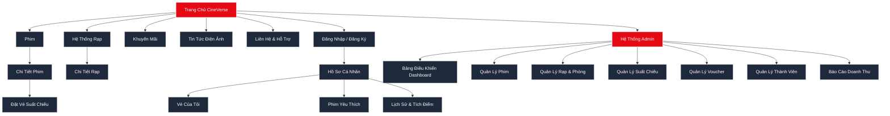
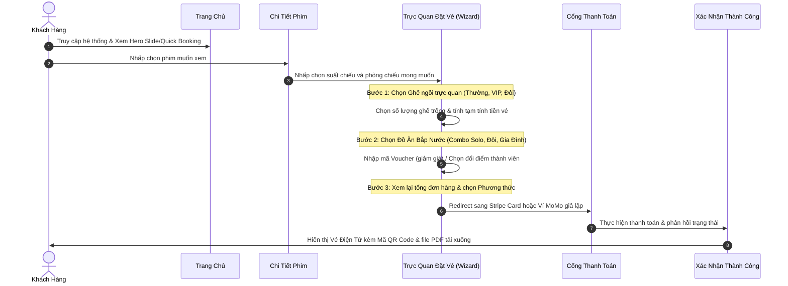

# 🎬 CINEVERSE - UI/UX MASTER PLAN
## TÀI LIỆU KHẢO SÁT & THIẾT KẾ GIAO DIỆN (PHIÊN BẢN PORTFOLIO)

> Tài liệu này mô phỏng quy trình thiết kế Figma, cung cấp Sitemap, User Flow, Wireframe mô tả chi tiết 30 màn hình, và hệ thống linh kiện (Component Library) trước khi tiến hành xây dựng mã nguồn Frontend.

---

## 🎨 1. CONCEPT & HỆ THỐNG NHẬN DIỆN THƯƠNG HIỆU

CineVerse định hướng là một nền tảng quản lý và đặt vé rạp chiếu phim hiện đại, kết hợp trải nghiệm mua sắm nhanh gọn của **Apple**, giao diện trực quan sinh động của **Netflix**, cùng các nghiệp vụ thực tế từ các chuỗi rạp lớn như **CGV** và **Galaxy Cinema**.

### Bảng màu chủ đạo (Color Palette)
* **Primary (Màu chủ đạo):** `#E50914` (Cinema Red - Đỏ điện ảnh rực rỡ, tạo cảm giác kích thích giác quan và nhiệt huyết).
* **Background (Nền):** `#0F172A` (Deep Slate - Xám đen sâu thẳm, giảm mỏi mắt, giả lập không gian phòng chiếu bóng tối).
* **Card/Panel (Khung chứa):** `#1E293B` (Gần giống nền nhưng sáng hơn, tạo độ tương phản chiều sâu nổi bật).
* **Gold (Màu nhấn/Xếp hạng):** `#FBBF24` (Vàng hoàng kim dùng cho sao đánh giá, ưu đãi đặc biệt).
* **Success (Thành công):** `#22C55E` (Xanh lá dùng cho thông báo thanh toán thành công, ghế trống đang chọn).
* **Danger (Cảnh báo):** `#EF4444` (Đỏ tươi dùng cho thông báo hủy vé, ghế đã đặt).

### Typography
* **Heading Font:** `Poppins` (Hiện đại, bo tròn nhẹ nhàng, tạo sự sang trọng).
* **Content Font:** `Inter` (Tối ưu hóa khả năng đọc trên mọi kích thước màn hình).

---

## 🗺️ 2. SITEMAP HỆ THỐNG (TOÀN CỤC)



---

## 🔄 3. USER FLOW (LUỒNG NGƯỜI DÙNG CHỦ CHỐT)

### Luồng Đặt Vé & Thanh Toán Trực Tuyến



---

## 🎨 4. WIREFRAME DESIGN (BẢN VẼ PHÁC THẢO ASCII)

### Màn hình 1: Trang Chủ (Home Page)
```
┌────────────────────────────────────────────────────────────────────────────────────────────────┐
│ 🍿 CINEVERSE          Phim    Lịch Chiếu    Rạp    Khuyến Mãi    Tin Tức   [Tìm Kiếm...]   [👤] │
├────────────────────────────────────────────────────────────────────────────────────────────────┤
│                                                                                                │
│  ◀  [============================= HERO BANNER SLIDER =============================]  ▶       │
│     ┌───────────┐  🎬 ĐẬP NÁT ĐỊA NGỤC (INSIDE OUT 2)                                          │
│     │           │  ⭐️⭐️⭐️⭐️☆ (4.8/5)  ·  Hoạt hình, Hài Hước  ·  96 phút  ·  PG                               │
│     │  POSTER   │  Mô tả: Những cảm xúc mới xuất hiện trong tâm trí cô bé Riley...             │
│     │           │                                                                              │
│     │           │  [ ▶️ Xem Trailer ]           [ 🎟️ Đặt Vé Ngay ]                              │
│     └───────────┘                                                                              │
│                                                                                                │
├────────────────────────────────────────────────────────────────────────────────────────────────┤
│ ⚡️ ĐẶT VÉ NHANH:                                                                               │
│  [ Chọn Phim    ▼ ]  |  [ Chọn Rạp    ▼ ]  |  [ Chọn Ngày    ▼ ]  |  [ Suất Chiếu ▼ ]  ➔ [ 🎟️ ĐẶT VÉ ]│
├────────────────────────────────────────────────────────────────────────────────────────────────┤
│ 🔥 PHIM ĐANG CHIẾU                                                                              │
│   ┌───────────┐   ┌───────────┐   ┌───────────┐   ┌───────────┐   ┌───────────┐   ┌───────────┐│
│   │  POSTER   │   │  POSTER   │   │  POSTER   │   │  POSTER   │   │  POSTER   │   │  POSTER   ││
│   │  Inside2  │   │ Deadpool  │   │Interstel  │   │  Dune 2   │   │Despic. 4  │   │  Quiet 1  ││
│   │ [ Đặt Vé ]│   │ [ Đặt Vé ]│   │ [ Đặt Vé ]│   │ [ Đặt Vé ]│   │ [ Đặt Vé ]│   │ [ Đặt Vé ]││
│   └───────────┘   └───────────┘   └───────────┘   └───────────┘   └───────────┘   └───────────┘│
├────────────────────────────────────────────────────────────────────────────────────────────────┤
│ 🎁 TIN KHUYẾN MÃI                                                                              │
│   ┌──────────────────────────┐   ┌──────────────────────────┐   ┌──────────────────────────┐   │
│   │ [Banner] Giảm 50% Vé     │   │ [Banner] Combo Bắp Nước  │   │ [Banner] Thứ 4 Vui Vẻ    │   │
│   └──────────────────────────┘   └──────────────────────────┘   └──────────────────────────┘   │
├────────────────────────────────────────────────────────────────────────────────────────────────┤
│ 🎬 HỆ THỐNG RẠP ĐỐI TÁC                                                                        │
│   [ CGV Cinema ]     [ Galaxy Cinema ]     [ Lotte Cinema ]     [ BHD Star ]                   │
└────────────────────────────────────────────────────────────────────────────────────────────────┘
```

### Màn hình 3: Chi Tiết Phim (Movie Detail)
```
┌────────────────────────────────────────────────────────────────────────────────────────────────┐
│ 🍿 CINEVERSE          Phim    Lịch Chiếu    Rạp    Khuyến Mãi    Tin Tức   [Tìm Kiếm...]   [👤] │
├────────────────────────────────────────────────────────────────────────────────────────────────┤
│  Trang Chủ / Phim / Deadpool & Wolverine                                                       │
│                                                                                                │
│  ┌───────────────┐   🎬 DEADPOOL & WOLVERINE                                                   │
│  │               │   ⭐️⭐️⭐️⭐️⭐️ (5.0/5)  ·  Hành Động, Hài Hước  ·  127 phút                        │
│  │               │   ──────────────────────────────────────────────────────────                │
│  │    POSTER     │   Đạo diễn: Shawn Levy            | Ngôn ngữ: Tiếng Anh                     │
│  │               │   Diễn viên: Ryan Reynolds,...    | Phụ đề: Tiếng Việt                      │
│  │     LARGE     │   Độ tuổi: T18 (Dưới 18 cấm)      | Nhân vật: Deadpool, Logan               │
│  │               │   ──────────────────────────────────────────────────────────                │
│  │               │   Tóm tắt: Deadpool buộc phải hợp tác với Wolverine để giải cứu vũ trụ      │
│  │               │   khỏi mối đe dọa tận thế mới...                                            │
│  │               │   ──────────────────────────────────────────────────────────                │
│  └───────────────┘   [ ▶️ Xem Trailer ]       [ 🎟️ Cuộn xuống chọn Suất Chiếu ]                │
│                                                                                                │
│  📅 LỊCH CHIẾU VÀ ĐẶT VÉ                                                                        │
│  ┌──────────────────────────────────────────────────────────────────────────────────────────┐  │
│  │  [Thứ Hai, 14/07]  ·  [Thứ Ba, 15/07]  ·  [Thứ Tư, 16/07]  ·  [Thứ Năm, 17/07]               │  │
│  ├──────────────────────────────────────────────────────────────────────────────────────────┤  │
│  │  📍 CineVerse Royal City                                                                 │  │
│  │     Format 2D:   [ 09:00 ]   [ 11:30 ]   [ 14:00 ]   [ 17:30 ]   [ 20:30 ]                   │  │
│  │     Format 3D:   [ 10:00 ]   [ 15:30 ]   [ 21:00 ]                                           │  │
│  │  📍 CineVerse Landmark 72                                                                │  │
│  │     Format 2D:   [ 12:00 ]   [ 18:30 ]   [ 22:00 ]                                           │  │
│  └──────────────────────────────────────────────────────────────────────────────────────────┘  │
└────────────────────────────────────────────────────────────────────────────────────────────────┘
```

### Màn hình 13: Wizard - Chọn Ghế (Booking Flow - Step 1)
```
┌────────────────────────────────────────────────────────────────────────────────────────────────┐
│ 🍿 CINEVERSE          Phim    Lịch Chiếu    Rạp    Khuyến Mãi    Tin Tức   [Tìm Kiếm...]   [👤] │
├────────────────────────────────────────────────────────────────────────────────────────────────┤
│  [ (1) Chọn Ghế ] ---------> (2) Chọn Bắp Nước ---------> (3) Thanh Toán                       │
├────────────────────────────────────────────────────────────────────────────────────────────────┤
│ 🎭 CHỌN GHẾ CỦA BẠN (Deadpool & Wolverine · IMAX Hall 1)              │ 🧾 TÓM TẮT ĐƠN HÀNG    │
│                                                                       │ Deadpool & Wolverine   │
│                        [ ======== MÀN HÌNH ======== ]                 │ IMAX Hall 1            │
│                                                                       │ 📅 14/07 • 20:30       │
│      Hàng A  [01] [02] [03] [04]  |  [05] [06] [07] [08]              │ ────────────────────── │
│      Hàng B  [01] [02] [03] [04]  |  [05] [06] [07] [08]              │ Ghế đã chọn:           │
│      Hàng C  [01] [02] [03] [04]  |  [05] [06] [07] [08]  (Thường)     │ [ C5, C6 ]             │
│      Hàng D  [01] [02] [03] [04]  |  [05] [06] [07] [08]  (VIP)        │                        │
│      Hàng E  [👥👥 01-02]         |  [👥👥 03-04]         (Đôi)       │ Tạm tính vé:           │
│                                                                       │ 240.000 VNĐ            │
│  ───────────────────────────────────────────────────────────────────  │ Tạm tính combo:        │
│  Legend: [ ] Thường (80k)  [ ] VIP (120k)  [👥] Đôi (200k)             │ 0 VNĐ                  │
│          [ ] Đang Chọn     [X] Đã Đặt                                 │ ────────────────────── │
│                                                                       │ TỔNG CỘNG:             │
│  [ Tiếp tục chọn Combo ➔ ]                                             │ 240.000 VNĐ            │
└────────────────────────────────────────────────────────────────────────────────────────────────┘
```

### Màn hình 14: Wizard - Chọn Bắp Nước (Booking Flow - Step 2)
```
┌────────────────────────────────────────────────────────────────────────────────────────────────┐
│ 🍿 CINEVERSE          Phim    Lịch Chiếu    Rạp    Khuyến Mãi    Tin Tức   [Tìm Kiếm...]   [👤] │
├────────────────────────────────────────────────────────────────────────────────────────────────┤
│  Chọn Ghế ---------> [ (2) Chọn Bắp Nước ] ---------> Thanh Toán                               │
├────────────────────────────────────────────────────────────────────────────────────────────────┤
│ 🍿 CHỌN BẮP NƯỚC & ĐỒ ĂN NHẸ                                          │ 🧾 TÓM TẮT ĐƠN HÀNG    │
│  Tăng trải nghiệm xem phim của bạn với bắp ngô và nước uống tươi ngon │ Deadpool & Wolverine   │
│                                                                       │ IMAX Hall 1            │
│  ┌─────────────────────────────────────────────────────────────────┐  │ 📅 14/07 • 20:30       │
│  │ 🍿 Combo Solo                                                   │  │ ────────────────────── │
│  │    1 Bắp ngọt lớn + 1 Nước ngọt cỡ vừa                          │  │ Ghế đã chọn:           │
│  │    Giá: 75.000 VNĐ                       [ - ]  [ 1 ]  [ + ]    │  │ [ C5, C6 ]             │
│  ├─────────────────────────────────────────────────────────────────┤  │                        │
│  │ 🥤 Combo Đôi                                                    │  │ Tạm tính vé:           │
│  │    1 Bắp lớn tự chọn vị + 2 Nước ngọt lớn                       │  │ 240.000 VNĐ            │
│  │    Giá: 105.000 VNĐ                      [ - ]  [ 1 ]  [ + ]    │  │                        │
│  └─────────────────────────────────────────────────────────────────┘  │ Combo đã chọn:         │
│                                                                       │ - Combo Solo (x1)      │
│  [  ← Quay lại Chọn Ghế ]           [ Tiếp tục thanh toán ➔ ]         │ - Combo Đôi (x1)       │
│                                                                       │ Tạm tính combo:        │
│                                                                       │ 180.000 VNĐ            │
│                                                                       │ ────────────────────── │
│                                                                       │ TỔNG CỘNG:             │
│                                                                       │ 420.000 VNĐ            │
└────────────────────────────────────────────────────────────────────────────────────────────────┘
```

### Màn hình 15: Wizard - Thanh Toán (Booking Flow - Step 3)
```
┌────────────────────────────────────────────────────────────────────────────────────────────────┐
│ 🍿 CINEVERSE          Phim    Lịch Chiếu    Rạp    Khuyến Mãi    Tin Tức   [Tìm Kiếm...]   [👤] │
├────────────────────────────────────────────────────────────────────────────────────────────────┤
│  Chọn Ghế ---------> Chọn Bắp Nước ---------> [ (3) Thanh Toán ]                               │
├────────────────────────────────────────────────────────────────────────────────────────────────┤
│ 🔒 THANH TOÁN & ĐẶT VÉ                                                │ 🧾 TÓM TẮT ĐƠN HÀNG    │
│                                                                       │ Deadpool & Wolverine   │
│  💳 PHƯƠNG THỨC THANH TOÁN                                             │ IMAX Hall 1            │
│  [ (🔘) Thẻ Stripe (Visa/Master) ]    [ ( ) Ví Điện Tử MoMo ]          │ Ghế: [ C5, C6 ]        │
│                                                                       │ Combos: Solo x1, Đôi x1│
│  ┌─────────────────────────────────────────────────────────────────┐  │ ────────────────────── │
│  │ Số Thẻ:       [ 4242  4242  4242  4242 ]                        │  │ Tạm tính vé:           │
│  │ Hết Hạn:      [ 12 / 28 ]            CVC: [ 123 ]               │  │ 240.000 VNĐ            │
│  └─────────────────────────────────────────────────────────────────┘  │ Tạm tính combo:        │
│  🎟️ VOUCHER KHUYẾN MÃI                                                 │ 180.000 VNĐ            │
│  [ Nhập mã giảm giá...     ]   [ Áp dụng ]                             │ Đã giảm giá:           │
│  💡 Gợi ý mã tốt nhất: SUMMER2026 (-50.000đ) ➔ [Áp dụng]              │ - 50.000 VNĐ           │
│                                                                       │ Tích điểm đổi:         │
│  👤 TÍCH ĐIỂM THÀNH VIÊN                                               │ - 20.000 VNĐ           │
│  [ Dùng 20 điểm thành viên ]  ➔ Giảm ngay 20.000 VNĐ                  │ ────────────────────── │
│                                                                       │ TỔNG CỘNG:             │
│  [  ← Quay lại Chọn Combo ]           [ 🔒 HOÀN TẤT THANH TOÁN ]        │ 350.000 VNĐ            │
└────────────────────────────────────────────────────────────────────────────────────────────────┘
```

### Màn hình 22: Bảng Điều Khiển Admin (Admin Dashboard)
```
┌────────────────────────────────────────────────────────────────────────────────────────────────┐
│ ⚙️ CINEVERSE ADMIN     | 📊 Dashboard    🎬 Phim    🏢 Rạp    🕓 Suất Chiếu    👥 Thành Viên    [👤]│
├───────────────────────┴────────────────────────────────────────────────────────────────────────┤
│ 📊 TRANG TỔNG QUAN HỆ THỐNG                                                                    │
│                                                                                                │
│  ┌──────────────────┐  ┌──────────────────┐  ┌──────────────────┐  ┌──────────────────┐        │
│  │ DOANH THU THÁNG  │  │ VÉ ĐÃ BÁN (TUẦN) │  │ PHIM ĐANG CHIẾU  │  │ THÀNH VIÊN MỚI   │        │
│  │ 128.540.000 VNĐ  │  │ 845 vé           │  │ 12 phim          │  │ +24 tài khoản    │        │
│  │ ↑ +12% hôm qua   │  │ ↑ +5% tuần trước │  │ Hoạt động tốt    │  │ 24h qua          │        │
│  └──────────────────┘  └──────────────────┘  └──────────────────┘  └──────────────────┘        │
│                                                                                                │
│  📈 BIỂU ĐỒ DOANH THU THEO THÁNG (VNĐ)                                                          │
│  200M ┼                                                                                        │
│  150M ┼          *---*                                                                         │
│  100M ┼    *----*     *                                                                        │
│   50M ┼   *            *                                                                       │
│    0M ┴───┴────┴────┴──┴────────────────────────────────────────────────────────────           │
│          Th4  Th5  Th6  Th7                                                                    │
│                                                                                                │
│  🏆 BẢNG XẾP HẠNG PHIM ĂN KHÁCH                 🛎️ YÊU CẦU ĐẶT VÉ MỚI NHẤT                      │
│  1. Inside Out 2 (384 vé)                       - customer@cinema.com đặt vé #BK8492  (2 phút) │
│  2. Deadpool & Wolverine (292 vé)               - admin@cinema.com hoàn tiền vé #BK8210 (15 phút)│
└────────────────────────────────────────────────────────────────────────────────────────────────┘
```

---

## 🏛️ 5. MỞ RỘNG MÔ HÌNH DỮ LIỆU & DESIGN PATTERNS MAP

Dù giao diện được làm mới với tính năng Combo Bắp nước và tích lũy điểm, hệ thống core backend vẫn duy trì tính toàn vẹn thông qua việc tích hợp 12 Design Patterns kinh điển.

### Sơ đồ quan hệ thực thể (ERD Mô tả)
* **Movie:** Quản lý thông tin phim, độ tuổi, trailer.
* **Cinema & Screen:** Chi tiết rạp, phòng chiếu phim.
* **Seat:** Thuộc Screen, phân loại loại ghế (`normal`, `vip`, `couple`).
* **Showtime:** Kết nối Movie + Screen + Khung giờ chiếu + Price Multiplier.
* **Booking & BookingItem:** Đơn đặt vé của User. `BookingItem` liên kết với ghế ngồi.
* **Combo (Bắp Nước) & BookingCombo:** Lưu trữ món ăn và số lượng đặt kèm trong `Booking`.
* **Voucher / Promo:** Chiết khấu tiền trực tiếp dựa trên tổng đơn hàng.
* **Loyalty Points & History:** Điểm thưởng thành viên dùng để chiết khấu trực tiếp 50% tiền vé.

### 🧩 Bản đồ Ánh xạ 12 Mẫu thiết kế (Design Patterns Mapping)

```mermaid
graph TD
    classDef pat fill:#E50914,stroke:#fff,color:#fff;
    classDef impl fill:#1E293B,stroke:#ccc,color:#fff;

    Singleton[Singleton Pattern]:::pat -->|Khởi tạo & Quản lý kết nối| DB[Database Connection / Email Service]:::impl
    
    Factory[Factory / Abstract Factory]:::pat -->|Tạo tự động| Seats[Ghế ngồi: Normal, VIP, Couple]:::impl
    
    Builder[Builder Pattern]:::pat -->|Xây dựng hóa đơn phức tạp| BookingBuilder[Booking & Invoice Builder]:::impl
    
    Prototype[Prototype Pattern]:::pat -->|Nhân bản cấu trúc phòng chiếu| RoomGrid[Screen Room Layout Cloning]:::impl
    
    Adapter[Adapter Pattern]:::pat -->|Tương thích cổng thanh toán| PayGate[Stripe / MoMo Payment Gateway]:::impl
    
    Decorator[Decorator Pattern]:::pat -->|Bọc tính năng quyền hạn| Security[RoleRequired & CSRF Decorators]:::impl
    
    Facade[Facade Pattern]:::pat -->|Rút gọn giao diện dịch vụ| BookingFacade[BookingService Facade]:::impl
    
    Strategy[Strategy Pattern]:::pat -->|Các thuật toán chiết khấu| Discount[Voucher & Loyalty Points Strategies]:::impl
    
    Observer[Observer Pattern]:::pat -->|Lắng nghe trạng thái đặt vé| Notification[Email & In-App Notifications]:::impl
    
    State[State Pattern]:::pat -->|Quản lý chu kỳ đơn đặt vé| TicketState[Booking Status: Pending, Confirmed, Cancelled]:::impl
    
    Command[Command Pattern]:::pat -->|Điều khiển tác vụ đảo ngược| CancelBooking[Cancel & Refund Ticket Command]:::impl
```



---

## 📦 6. HỆ THỐNG LINH KIỆN ĐỒ HỌA (COMPONENT LIBRARY)

Bộ linh kiện được xây dựng nhằm đảm bảo tính đồng bộ UI/UX, tái sử dụng dễ dàng trên cả module Khách Hàng và Quản Trị:

### 1. Nút Bấm (Button Components)
* **`.btn-primary` (Đỏ `#E50914`):** Nút hành động chính (Đặt vé, Thanh toán, Lưu thông tin).
* **`.btn-secondary` (Xám đậm):** Nút quay lại, đóng modal, hủy bỏ.
* **`.btn-outline` (Viền đỏ/trắng):** Nút hành động phụ (Xem chi tiết, Xem trailer).
* **`.btn-danger` (Đỏ tươi `#EF4444`):** Sử dụng duy nhất cho chức năng hủy vé hoặc xóa phần tử.

### 2. Form & Inputs
* **`.form-input`:** Bo góc `radius-md`, nền tối `rgba(255,255,255,0.03)`, viền kính mờ (`border-glass`).
* **`.payment-card`:** Ô vuông lớn chứa logo phương thức thanh toán, có hiệu ứng phát sáng khi được chọn (`selected`).

### 3. Ghế Ngồi (Seat Elements)
* **`.seat-cell.normal`:** Nền tối mờ, biểu tượng đơn giản.
* **`.seat-cell.vip`:** Nền viền vàng cam nhẹ.
* **`.seat-cell.couple`:** Ô kép rộng gấp đôi, màu hồng dịu.
* **`.seat-cell.selected`:** Đổi màu sang đỏ hoặc xanh lá đặc trưng để nhận diện tức thì.
* **`.seat-cell.booked`:** Màu xám tối kèm biểu tượng khóa chéo, vô hiệu hóa khả năng nhấp chuột.

---

*Tài liệu này là cẩm nang kiến trúc giao diện phục vụ cho việc nâng cấp toàn diện và bảo vệ đồ án CineVerse.*
